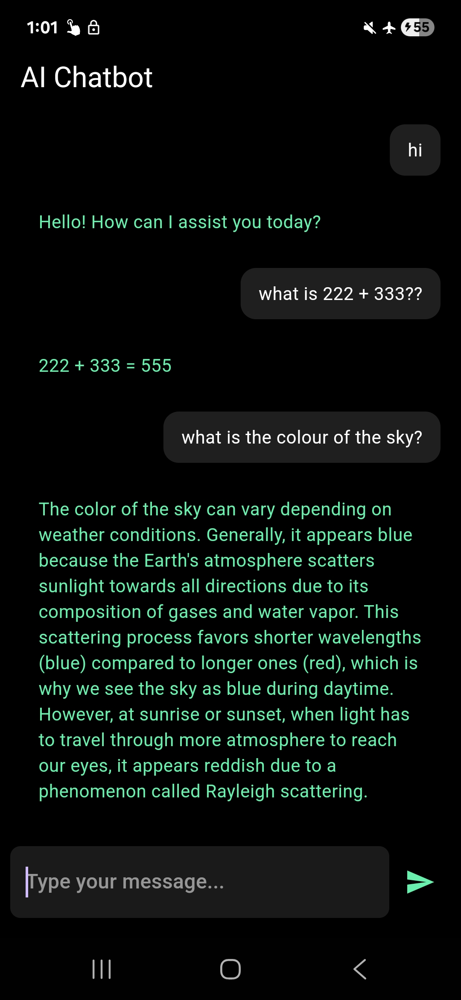

<p align="center">
  
</p>

# onenm_local_llm

[](https://pub.dev/packages/onenm_local_llm)
[]()

**Run local LLMs in Flutter apps with just a few lines of code.**

> **⚠️ Early MVP** — This plugin is in active early development. The API may change, and only Android arm64 devices are supported for now. Feedback and bug reports are welcome!

**onenm_local_llm** is a Flutter plugin that simplifies **on-device language model inference on Android using llama.cpp**.  
It removes the complexity of **setting up native runtimes, model loading, and inference pipelines**, so developers can integrate **local AI into their apps through a simple API**.

---

## Demo

<p align="center">
  
</p>

<p align="center">
  <a href="https://drive.google.com/file/d/1VBVnR_PuW4YN1B55S-YTZXo62AIxt93u/view?usp=sharing">▶️ Watch the demo video here</a>
</p>

---

## Features

- **100% on-device** — all inference runs locally using llama.cpp. No data leaves the phone.
- **Automatic model management** — downloads GGUF models from HuggingFace on first launch, caches them locally.
- **Multi-turn chat** — built-in conversation history and per-model chat templates (Zephyr, Phi-2, etc.).
- **Configurable sampling** — temperature, top-k, top-p, repeat penalty, max tokens.
- **Simple API** — `initialize()`, `chat()`, `dispose()` — that's all you need.
- **Retry logic** — automatic retries with exponential backoff for downloads and model loading, plus an optional retry callback so apps can show a retry button when internet is unavailable or disconnects mid-download.

## Supported Models

| Model                    | Size    | RAM  | Context | ID                     |
| ------------------------ | ------- | ---- | ------- | ---------------------- |
| TinyLlama 1.1B Chat      | ~638 MB | 2 GB | 2048    | `OneNmModel.tinyllama` |
| Phi-2 2.7B               | ~1.6 GB | 4 GB | 2048    | `OneNmModel.phi2`      |
| Qwen2.5 1.5B Instruct    | ~1.1 GB | 2 GB | 32768   | `OneNmModel.qwen25`    |
| Gemma 2B IT              | ~1.5 GB | 3 GB | 8192    | `OneNmModel.gemma2b`   |
| Llama 3.2 3B Instruct    | ~2.0 GB | 4 GB | 131072  | `OneNmModel.llama32`   |
| Mistral 7B Instruct v0.2 | ~4.4 GB | 8 GB | 32768   | `OneNmModel.mistral7b` |

> You can also create your own `ModelInfo` for any GGUF model — see [Custom Models](#custom-models).

## Requirements

- **Android** arm64-v8a device (most modern phones)
- **Min SDK** 21 (Android 5.0)
- **Flutter** ≥ 3.3.0
- **Internet** for first-time model download only

> **Note:** x86/x86_64 emulators are not supported — the prebuilt native libraries are arm64-v8a only. Use a physical device for testing.

### Tested On

| Device                | SoC            | RAM  | Models Tested                                                                | Status |
| --------------------- | -------------- | ---- | ---------------------------------------------------------------------------- | ------ |
| Samsung Galaxy S21 FE | Snapdragon 888 | 8 GB | TinyLlama 1.1B, Phi-2 2.7B, Qwen2.5 1.5B, Gemma 2B IT, Llama 3.2 3B Instruct | ✅     |
| Samsung Galaxy S9+    | Snapdragon 845 | 6 GB | TinyLlama 1.1B                                                               | ⚠️     |

> **⚠️ Samsung Galaxy S9+ note:** Model downloads and loads correctly, but inference may crash during prompt decoding due to insufficient memory for the default KV cache allocation. A fix (configurable context size cap) is planned for a future release. Devices with Snapdragon 855 or newer should work without issues.

> **🧪 Testing in progress** — We're working on testing all supported models across more devices. This table will be updated as results come in.

## Getting Started

### 1. Add the dependency

```bash
flutter pub add onenm_local_llm
```

Or add it manually to your `pubspec.yaml`:

```yaml
dependencies:
  onenm_local_llm: ^0.1.3
```

Then run `flutter pub get`.

> **📦 Storage note:** The first call to `initialize()` downloads the model file (e.g. TinyLlama ~638 MB, Phi-2 ~1.6 GB). Models are cached locally after the first download, so subsequent launches are fully offline.

### 2. Add internet permission

In your app's `android/app/src/main/AndroidManifest.xml`:

```xml
<uses-permission android:name="android.permission.INTERNET"/>
```

### 3. Use it

```dart
import 'package:onenm_local_llm/onenm_local_llm.dart';

// Create an instance with a model
final ai = OneNm(
  model: OneNmModel.tinyllama,
  onProgress: (status) => print(status),
  onRetryRequired: (message) async {
    // Show a retry button/dialog in your app and return:
    // true  -> retry download
    // false -> stop and throw the error
    return true;
  },
);

// Download (if needed) and load the model
await ai.initialize();

// Chat — history is maintained automatically
final reply = await ai.chat('What is Flutter?');
print(reply);

// Continue the conversation
final followUp = await ai.chat('Tell me more about its architecture.');
print(followUp);

// Start a new conversation
ai.clearHistory();

// Clean up when done
await ai.dispose();
```

## API Reference

### `OneNm`

The main entry point for the plugin.

#### Constructor

```dart
OneNm({
  required ModelInfo model,                // Which model to use
  GenerationSettings settings,             // Sampling parameters (optional)
  OneNmProgressCallback? onProgress,       // Status callback (optional)
  OneNmRetryCallback? onRetryRequired,     // Lets your app show a retry button/dialog
  bool debug = false,                      // Enable verbose [1nm] logs
})
```

#### `onProgress` — Showing Status in Your UI

The `onProgress` callback fires with human-readable status strings during download and model loading. Use it to keep your users informed:

```dart
// Status messages you'll receive (in order):
//   "Downloading TinyLlama 1.1B Chat (~638 MB)..."
//   "Downloading TinyLlama 1.1B Chat...\n45% (287.1 / 638.0 MB)"
//   "Download complete"
//   "Loading model..."
//   "Ready"

String status = 'Tap to start';

final ai = OneNm(
  model: OneNmModel.tinyllama,
  onProgress: (msg) => setState(() => status = msg),
);

// Then in your build():
Text(status)  // Shows live progress to the user
```

#### `onRetryRequired` — Showing a Retry Button

The optional `onRetryRequired` callback is triggered when there is no internet connection before download starts, or when internet gets disconnected while downloading. This package does not render UI itself, so your app can use this callback to show a simple retry button, dialog, or snackbar.

Return `true` to retry the download, or `false` to stop and let the plugin throw the error.

```dart
final ai = OneNm(
  model: OneNmModel.tinyllama,
  onProgress: (msg) => setState(() => status = msg),
  onRetryRequired: (message) async {
    return await showDialog<bool>(
          context: context,
          barrierDismissible: false,
          builder: (context) => AlertDialog(
            title: const Text('Download paused'),
            content: Text(message),
            actions: [
              TextButton(
                onPressed: () => Navigator.pop(context, false),
                child: const Text('Cancel'),
              ),
              FilledButton(
                onPressed: () => Navigator.pop(context, true),
                child: const Text('Retry'),
              ),
            ],
          ),
        ) ??
        false;
  },
);
```

#### Methods

| Method                                         | Description                                                                                                                        |
| ---------------------------------------------- | ---------------------------------------------------------------------------------------------------------------------------------- |
| `initialize()`                                 | Downloads the model (if not cached) and loads it. Must be called first.                                                            |
| `chat(String message, {String? systemPrompt})` | Sends a message and returns the model's reply. Maintains conversation history and applies the model's chat template automatically. |
| `generate(String prompt)`                      | Raw text completion without chat formatting. For advanced/custom use.                                                              |
| `clearHistory()`                               | Resets conversation history to start a fresh chat session.                                                                         |
| `dispose()`                                    | Releases all native resources.                                                                                                     |

### Debug Logging

Enable verbose logs to see what the plugin is doing under the hood:

```dart
final ai = OneNm(
  model: OneNmModel.tinyllama,
  debug: true,
);
```

Output in the debug console:

```
[1nm] Initializing with model: TinyLlama 1.1B Chat
[1nm] Settings: temp=0.7, topK=40, topP=0.9, maxTokens=128, repeatPenalty=1.1
[1nm] Model found (637.8 MB)
[1nm] Loading model...
[1nm] Model loaded in 4.2s
[1nm] Ready
[1nm] Total initialization: 4.3s
[1nm] Chat message (12 chars, 1 turns)
[1nm] Formatted prompt: 95 chars
[1nm] Generating response...
[1nm] Response generated in 2.1s (142 chars)
[1nm] History cleared (was 2 messages)
[1nm] Disposed
```

When `debug` is `false` (the default), no logs are printed — only `onProgress` callbacks fire.

### `GenerationSettings`

Controls sampling behavior during text generation.

```dart
const settings = GenerationSettings(
  temperature: 0.7,     // Randomness (0 = deterministic, >1 = creative)
  topK: 40,             // Keep only top-K most probable tokens
  topP: 0.9,            // Nucleus sampling threshold
  maxTokens: 128,       // Max tokens to generate per call
  repeatPenalty: 1.1,   // Penalise repeated tokens (1.0 = off)
);

final ai = OneNm(
  model: OneNmModel.tinyllama,
  settings: settings,
);
```

### `OneNmModel`

Pre-configured model registry. Access built-in models:

```dart
OneNmModel.tinyllama   // TinyLlama 1.1B Chat (Q4_K_M)
OneNmModel.phi2        // Phi-2 2.7B (Q4_K_M)
OneNmModel.qwen25      // Qwen2.5 1.5B Instruct (Q4_K_M)
OneNmModel.gemma2b     // Gemma 2B IT (Q4_K_M)
OneNmModel.llama32     // Llama 3.2 3B Instruct (Q4_K_M)
OneNmModel.mistral7b   // Mistral 7B Instruct v0.2 (Q4_K_M)
OneNmModel.all         // List of all built-in models
```

### Custom Models

Create your own `ModelInfo` to use any GGUF model:

```dart
const myModel = ModelInfo(
  id: 'my-model',
  name: 'My Custom Model',
  fileName: 'my-model.Q4_K_M.gguf',
  ggufUrl: 'https://huggingface.co/.../resolve/main/my-model.Q4_K_M.gguf',
  sizeMB: 1000,
  minRamGB: 3,
  context: 4096,
  chatTemplate: ChatTemplate(
    system: '<|system|>\n{text}</s>\n',
    user: '<|user|>\n{text}</s>\n',
    assistant: '<|assistant|>\n{text}</s>\n',
  ),
);

final ai = OneNm(model: myModel);
```

## Architecture

```
┌─────────────┐     MethodChannel     ┌──────────────────┐
│  Dart API    │ ◄──────────────────► │  Kotlin Plugin    │
│  (OneNm)     │   "onenm_local_llm"  │  (OnenmLocalLlm)  │
└─────────────┘                       └────────┬─────────┘
                                               │ JNI
                                      ┌────────▼─────────┐
                                      │  C++ Bridge       │
                                      │  (onenm_bridge)   │
                                      └────────┬─────────┘
                                               │
                                      ┌────────▼─────────┐
                                      │  llama.cpp        │
                                      │  (prebuilt .so)   │
                                      └──────────────────┘
```

**Layer breakdown:**

| Layer              | Language | File(s)                                       | Role                                                |
| ------------------ | -------- | --------------------------------------------- | --------------------------------------------------- |
| Public API         | Dart     | `lib/onenm_local_llm.dart`, `lib/models.dart` | User-facing `OneNm` class, model registry, settings |
| Platform interface | Dart     | `lib/onenm_local_llm_platform_interface.dart` | Federated plugin contract                           |
| Method channel     | Dart     | `lib/onenm_local_llm_method_channel.dart`     | Dart ↔ native serialisation                         |
| Plugin host        | Kotlin   | `OnenmLocalLlmPlugin.kt`                      | Routes method calls, coroutine dispatch             |
| JNI bridge         | Kotlin   | `OneNmNative.kt`                              | `external fun` declarations, library loading        |
| Native bridge      | C++      | `onenm_bridge.cpp`                            | llama.cpp integration, sampling loop                |
| Inference engine   | C        | Prebuilt `.so` files                          | llama.cpp, ggml backends                            |

## Project Structure

```
flutter-llama.cpp/
├── lib/                              # Dart public API
│   ├── onenm_local_llm.dart          #   OneNm class
│   ├── models.dart                   #   ModelInfo, ChatTemplate, GenerationSettings
│   ├── onenm_local_llm_platform_interface.dart
│   └── onenm_local_llm_method_channel.dart
├── android/
│   ├── build.gradle
│   └── src/main/
│       ├── kotlin/.../
│       │   ├── OnenmLocalLlmPlugin.kt  # Flutter plugin
│       │   └── OneNmNative.kt          # JNI declarations
│       ├── cpp/
│       │   ├── onenm_bridge.cpp        # C++ ↔ llama.cpp
│       │   ├── CMakeLists.txt
│       │   └── llama/                  # llama.cpp headers
│       └── jniLibs/arm64-v8a/          # Prebuilt .so files
├── example/                           # Demo chat app
│   └── lib/main.dart
├── test/                              # Unit tests
├── LICENSE
├── README.md
├── CHANGELOG.md
└── CONTRIBUTING.md
```

## Building from Source

The plugin ships with prebuilt llama.cpp libraries for `arm64-v8a`. If you need to rebuild them (e.g. for a newer llama.cpp version or different ABI):

1. Clone [llama.cpp](https://github.com/ggml-org/llama.cpp)
2. Build for Android arm64-v8a using the NDK:

   ```bash
   mkdir build-android && cd build-android
   cmake .. \
     -DCMAKE_TOOLCHAIN_FILE=$NDK/build/cmake/android.toolchain.cmake \
     -DANDROID_ABI=arm64-v8a \
     -DANDROID_PLATFORM=android-21
   make -j$(nproc)
   ```

3. Copy the resulting `.so` files to `android/src/main/jniLibs/arm64-v8a/`
4. Copy the public headers to `android/src/main/cpp/llama/`

## Roadmap

<!-- Coming soon — this section will be expanded as the project matures. -->

- 🍎 **iOS support**
- 📡 **Streaming responses** — token-by-token output via streams
- 🧠 **More models** — Gemma, Mistral, and other popular GGUF models
- ⚡ **Performance & memory improvements** — reduced footprint, faster cold-start

## Known Limitations

- **Android only** — iOS support is not yet implemented.
- **arm64-v8a only** — x86/x86_64 emulators cannot load the prebuilt libraries.
- **Single model** — only one model can be loaded at a time.
- **No streaming** — `chat()` and `generate()` return the full response; token-by-token streaming is not yet supported.

## License

This project is licensed under the MIT License — see the [LICENSE](../LICENSE) file for details.

llama.cpp is licensed under the MIT License. See [llama.cpp LICENSE](https://github.com/ggml-org/llama.cpp/blob/master/LICENSE).

## Contributing

We welcome contributions to improve **onenm_local_llm**! At this stage, contributions are limited to adding new models to the model registry and testing them. Please see [CONTRIBUTING.md](../CONTRIBUTING.md) for detailed guidelines.
